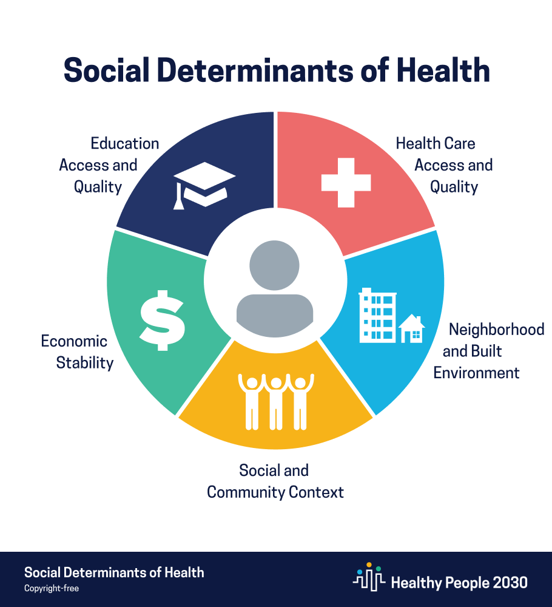

# Social Determinants of Health & the COVID-19 Pandemic

## Supervised Learning Classification Model Predicting the Spread & Mortality of COVID-19, Extensible to Future Pandemics/Epidemics

Kristin Cooper | July, 2021 | DTSC-FT-022221 | Instructor: James Irving



<center> Equality vs. equity <br> <i> <a href="interactioninstitute.org">Interaction Institute for Social Change</a> // Angus Maguire</i> </center>
_______

## Purpose:

The purpose of this report is to study social, economic, and health inequities in the US and predict how those inequities influenced the spread and mortality of COVID-19 in a community/region. Predictions should be used to inform public policy and preparation for future pandemics/epidemics.

My original intent was to perform this analysis at the county level. However, finding reliable county-level COVID-19 case and death reports proved difficult. 23 states had a total of ~83k cases and ~1700 deaths that were unattributable to a county, based on differences in reporting structure and unclear reporting protocols between where the case was treated vs where the patient lived. 

Results described below are currently at the state level, with an intent to revisit the county-level data in the future.

_______

## Data:

A variety of health, economic, social, and demographic data from the CDC and University of Wisconsin Public Health Institute was combined with COVID-19 case, death, and vaccine measures.

### Features:

<table border="0">
 <tr align=left alight=top>
    <td><b style="font-size:20px">COVID-19 Stats</b></td>
    <td><b style="font-size:20px">Economic Measures</b></td>
    <td><b style="font-size:20px">Health Measures</b></td>
    <td><b style="font-size:20px">Social Measures</b></td>
    <td><b style="font-size:20px">Demographics</b></td>
 </tr>
 <tr>
    <td><ul>
        <li>Case count</li>
        <li>Death count</li>
        <li>Vaccine hesitancy</li>
        <li>CVAC vaccine rollout concern</li>
        </ul>
     </td>
    <td><ul>
        <li>Per capita income</li>
        <li>Median household income</li>
        <li>Income inequality</li>
        <li>Poverty rate</li>
        <li>Unemployment rate</li>
        </ul>
     </td>
    <td><ul>
        <li>Life expectancy and premature deaths</li>
        <li>Smoking and excessive drinking</li>
        <li>Obesity</li>
        <li>Poor health days (physical & mental)</li>
        <li>Physical inactivity</li>
        <li>Preventable hospital stays</li>
        <li>Ratio of population to primary care physicians</li>
        <li>Flu vaccinations</li>
        <li>Uninsured population</li>
        </ul>
     </td>
    <td><ul>
        <li>Housing</li>
        <li>Internet access</li>
        <li>Vehicle access</li>
        <li>Food environment and food insecurity</li>
        <li>Education</li>
        <li>Air and drinking water pollution</li>
        </ul>
     </td>
    <td><ul>
        <li>Population and sq mileage</li>
        <li>Rural vs urban area</li>
        <li>Racial breakdown</li>
        <li>Elderly and child populations</li>
        </ul>
     </td>
    </tr>
</table>

### Sources:

- [CDC’s Social Vulnerability Index](https://www.atsdr.cdc.gov/placeandhealth/svi/documentation/SVI_documentation_2018.html)

- [CDC's Vaccine Hesitancy](https://data.cdc.gov/Vaccinations/Vaccine-Hesitancy-for-COVID-19-County-and-local-es/q9mh-h2tw)

- [The University of Wisconsin Population Health Institute's County Health Rankings](https://www.countyhealthrankings.org/explore-health-rankings/measures-data-sources) 
 
- [New York Times COVID Case and Death Counts](https://github.com/nytimes/covid-19-data)


____

## Approach:

This is a multinomial classification problem with an engineered 3-class target.

### Feature Engineering:

From the source data, the following initial features were engineered:

- Population density = population / area (sqmi)
- Cases per 100k = (cases / population) * 100,000
- Deaths per 100k = (deaths / population) * 100,000
- Percent of cases resulting in death, or 'deathrate' = (deaths / cases) * 100
- Impact points = ((1 * cases per 100k) + (3 * deaths per 100k)) * deathrate
- Impact category:
    - High = impact points > mean + (.8*(standard deviation))
    - Low = impact points < mean - (.8*(standard deviation)
    - Average = impact points within mean +/- (.8*(standard deviation))


### Modeling Techniques:

1. **Multiclass regressors** 
    - Tree-based models (decision tree, random forest)
    - K-Nearest Neighbors
    - Logistic Regression with `multi_class='multinomial'`
1. **One vs Rest (OVR) Meta-Classifiers** 
    - Gradient Boost Classifier
    - linear Support Vector Machine
    - Logistic Regression with `multi_class='ovr'`
1. **One vs One (OVO) Meta-Classifier** 
    - Support Vector Machine


### Evaluation Metrics:

Metrics for multiclass models could be calculated as either a macro average or a micro (weighted) average. Because training data is balanced using sklean.oversampling.SMOTE, I know my classes are balanced and can safely use the macro-average.

- **Overfitting** - the difference between the accuracy score on the training data and the accuracy score on the testing data

- **Accuracy** & **AUC** - measures of how many predictions the model gets right

- **F1 Score** - the harmonic mean of precision (how many predicted positives are true positives) and recall (how many actual positives were correctly predicted)


____

## Results


Based on population-controlled cases, deaths, and mortality rate of COVID-19, the following states experienced "high" impact of COVID-19: Arizona, South Dakota, Louisiana, Alabama, Mississippi, Pennsylvania, New Jersey, Connecticut, Rhode Island, and Massachusetts.

Given the health, social/demographic, economic, and COVID-19 measures, a K-Nearest Neighbors with optimal k=1 model predicted 91% of the validation dataset accurately. 

When trained on the full dataset and a limited dataset excluding health health measures, the following features were considered the most important to making accurate predictions:

<table border="0">
 <tr align=left alight=top>
    <td><b style="font-size:20px">Economic Measures</b></td>
    <td><b style="font-size:20px">Health Measures</b></td>
    <td><b style="font-size:20px">Social & Demographic Measures</b></td>
 </tr>
 <tr>
    <td><ul>
        <li>Per capita income</li>
        <li>Income inequality</li>
        <li>Unemployment rate</li>
        <li>Homeownership</li>
        </ul>
     </td>
    <td><ul>
        <li>Smoking</li>
        <li>Vaccine hesitancy</li>
        </ul>
     </td>
    <td><ul>
        <li>Square mileage</li>
        <li>Racial breakdown</li>
        <li>Child population</li>
        <li>Education</li>
        </ul>
     </td>
    </tr>
</table>


_____

## Recommendations

- States should have accurate, frequent **measurement plans** in place for each of the features shown here to increase their community's vulnerability to extensive spread of illness and mortality. **What you measure, you can manage!**

- When planning public health budgets, consider what **socioeconomic factors** - per capita income, minority population, vaccine hesitancy, etc. - may play a role in health outcomes and could be invested in with dollars allocated to "health."

- In the case of a pandemic, the federal government should be able to **allocate emergency funds according to vulnerability** in order to slow the spread of illness and limit unnecessary deaths. Policy makers should consider changes now to support the ability to move quickly in case of emergency.

_____

## Future Enhancements

- Rerun models with a slimmer feature set, avoiding multicollinearity
- Analyze at the county level with updated county-level case and death counts
- Incorporate ICU/hospital capacity, loss of employment, and local measure of economic activity in impact calculation


_____


### For further information:
Please review the full EDA notebook [here](./EDA.ipynb) and modeling notebook [here,](./model.ipynb) or review the [non-technical presentation](./presentation.pdf)

For any additional questions, please contact kcoop610@gmail.com.


#### Repository Structure:

```

├── README.md            
├── 1-EDA.ipynb           
├── 2-model.ipynb           
├── presentation.pdf                 
├── data
    └── source data files
├── data_compressed
    ├── merged_state_level_dataset.csv
    └── compressed data files
├── images
    └── images 
└── styles
    └── custom.css 

```